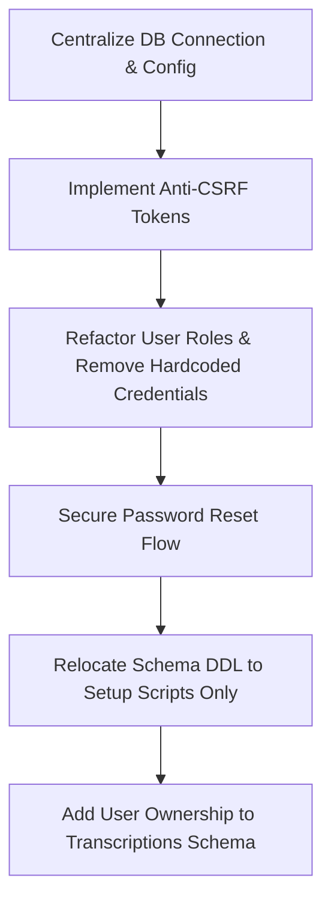

# 🌿 LinguaAI Project Review Report

## 1. Executive Summary

**LinguaAI** is a full-stack PHP/MySQL web application designed for academic research (PBL - Project-Based Learning) on preserving critically endangered native languages using AI speech recognition and digital archiving tools.

Overall, the project exhibits a **strong foundation**, **modern UI aesthetics**, and **rich interactive functionality** (including Web Speech API integration, Chart.js analytics, dynamic multi-language management, and an administrative dashboard). However, there are notable **security vulnerabilities** (GET-based CSRF, hardcoded admin credentials, password reset exposure) and **architectural smells** (duplicated PDO connections, on-the-fly table creation) that should be refactored before deployment.

---

## 2. Project Architecture & Technology Stack

| Layer | Technologies & Dependencies |
| :--- | :--- |
| **Frontend UI** | HTML5, Custom CSS3 (CSS Variables, Flexbox/Grid, Glassmorphism, Micro-animations), Google Fonts (*Playfair Display*, *DM Sans*) |
| **Client Logic** | JavaScript (ES6), jQuery 3.7.1, Web Speech API (`webkitSpeechRecognition`), Chart.js 4.x |
| **Backend API / Server** | PHP 8.x (Native PHP), Apache / XAMPP Stack |
| **Database** | MySQL / MariaDB via PHP PDO (`linguaai_db`) |
| **Utility Scripts** | Node.js helper scripts (`build_doc.js`, `generate_sou_ppt.js`), PHP CLI DB Setup (`scripts/setup_db.php`) |

---

## 3. Directory & File Structure Inventory

| Path | Purpose & Description |
| :--- | :--- |
| [`index.php`](file:///c:/xampp/htdocs/pbl-2/pbl/index.php) | Project homepage with hero section, animated statistics counter, interactive visual, and quick navigation. |
| [`transcribe.php`](file:///c:/xampp/htdocs/pbl-2/pbl/transcribe.php) | Core AI Speech Transcription tool utilizing Web Speech API with live text editing, audio waveform indicator, archive saving, and local TXT export. |
| [`languages.php`](file:///c:/xampp/htdocs/pbl-2/pbl/languages.php) | Endangered languages atlas featuring live search, status/region filters, interactive details modal, and a Chart.js doughnut chart. |
| [`admin.php`](file:///c:/xampp/htdocs/pbl-2/pbl/admin.php) | Complete super-admin dashboard managing users, languages, recognition locales, transcriptions, and inbox messages. |
| [`login.php`](file:///c:/xampp/htdocs/pbl-2/pbl/login.php) | Authentication endpoint handling both hardcoded college demo credentials and MySQL user database login. |
| [`register.php`](file:///c:/xampp/htdocs/pbl-2/pbl/register.php) | User registration form with secure `password_hash()` storing new accounts in MySQL. |
| [`logout.php`](file:///c:/xampp/htdocs/pbl-2/pbl/logout.php) | Session destruction and user logout redirect. |
| [`profile.php`](file:///c:/xampp/htdocs/pbl-2/pbl/profile.php) | User profile page showing account metadata and active participant status. |
| [`forgot_password.php`](file:///c:/xampp/htdocs/pbl-2/pbl/forgot_password.php) | Password recovery form with temporary password generation. |
| [`contact.php`](file:///c:/xampp/htdocs/pbl-2/pbl/contact.php) | Interactive contact page with reason selection chips and AJAX form submission. |
| [`backend.php`](file:///c:/xampp/htdocs/pbl-2/pbl/backend.php) | AJAX handler for contact submissions storing queries in database and sending email confirmations via `@mail`. |
| [`fetch_transcriptions.php`](file:///c:/xampp/htdocs/pbl-2/pbl/fetch_transcriptions.php) | REST-like JSON API endpoint for frontend transcription search and retrieval. |
| [`api_analytics.php`](file:///c:/xampp/htdocs/pbl-2/pbl/api_analytics.php) | JSON endpoint serving grouped language transcription counts for Chart.js rendering. |
| [`export_csv.php`](file:///c:/xampp/htdocs/pbl-2/pbl/export_csv.php) | Admin CSV exporter with UTF-8 BOM headers for Excel compatibility. |
| [`add_user.php`](file:///c:/xampp/htdocs/pbl-2/pbl/add_user.php) / [`edit_user.php`](file:///c:/xampp/htdocs/pbl-2/pbl/edit_user.php) | Admin forms for user account creation and modification. |
| [`add_lang.php`](file:///c:/xampp/htdocs/pbl-2/pbl/add_lang.php) / [`edit_lang.php`](file:///c:/xampp/htdocs/pbl-2/pbl/edit_lang.php) | Admin forms for language atlas management. |
| [`edit_msg.php`](file:///c:/xampp/htdocs/pbl-2/pbl/edit_msg.php) / [`edit_txn.php`](file:///c:/xampp/htdocs/pbl-2/pbl/edit_txn.php) | Admin management forms for messages and saved transcriptions. |
| [`style.css`](file:///c:/xampp/htdocs/pbl-2/pbl/style.css) / [`shared.js`](file:///c:/xampp/htdocs/pbl-2/pbl/shared.js) | Central stylesheet and shared JavaScript functionality (smooth scrolling, mobile menu, navbar state). |
| [`scripts/setup_db.php`](file:///c:/xampp/htdocs/pbl-2/pbl/scripts/setup_db.php) | Database initialization script creating tables (`transcriptions`, `messages`) and migrating legacy JSON files. |

---

## 4. Key Strengths & Feature Evaluation

1. **Integrated Web Speech API Transcriber**: Real-time microphone capture with client-side fallback handling, contenteditable live editing, and AJAX persistence to MySQL.
2. **Dynamic UI Filtering & Search**: Instant Client-Side and Server-side debounced search in both the language atlas ([`languages.php`](file:///c:/xampp/htdocs/pbl-2/pbl/languages.php)) and the admin panel ([`admin.php`](file:///c:/xampp/htdocs/pbl-2/pbl/admin.php)).
3. **Data Export & Analytics Integration**: High-value academic features including CSV exports with UTF-8 BOM encoding ([`export_csv.php`](file:///c:/xampp/htdocs/pbl-2/pbl/export_csv.php)) and live Chart.js visualizations ([`api_analytics.php`](file:///c:/xampp/htdocs/pbl-2/pbl/api_analytics.php)).
4. **Visual Design & UX**: Cohesive typography, custom HSL/RGB color system, responsive grid flex layout, and refined visual feedback (pulse recording state, subtle modal slide animations).

---

## 5. Vulnerability & Code Smell Analysis

> [!WARNING]
> The following issues require attention to ensure project security and maintainability.

### 🔴 Security Vulnerabilities

1. **CSRF (Cross-Site Request Forgery) in Admin Panel**:
   - *Location*: [`admin.php`](file:///c:/xampp/htdocs/pbl-2/pbl/admin.php#L62-L97)
   - *Detail*: Destructive operations (`delete_txn`, `delete_msg`, `delete_user`, `delete_lang`, `delete_rec_lang`, `toggle_rec_lang`) process via `GET` parameters without anti-CSRF token verification (e.g. `admin.php?delete_user=5`).
   - *Risk*: An authenticated admin visiting an external link or embedded image tag could unknowingly trigger deletions.

2. **Hardcoded Admin Credentials**:
   - *Location*: [`login.php`](file:///c:/xampp/htdocs/pbl-2/pbl/login.php#L11)
   - *Detail*: Hardcoded check `if ($user === 'admin' && $pass === 'LinguaAI2025')` grants administrative access bypassing the database user table.

3. **Plaintext Password Reset Exposure**:
   - *Location*: [`forgot_password.php`](file:///c:/xampp/htdocs/pbl-2/pbl/forgot_password.php#L29)
   - *Detail*: Displaying temporary passwords directly on screen (`(Note for local test: temporary password is passXXXX)`) allows account takeover by anyone who inputs an arbitrary user's email address.

4. **Prepared Statement Consistency**:
   - Most queries use prepared statements with placeholders (preventing SQL injection), but dynamic sorting and direct string parameter queries in edge helper scripts should be audited.

---

### 🟡 Architectural Smells & Code Quality

1. **Database Connection Duplication**:
   - *Location*: Found in 20+ separate files.
   - *Detail*: Every PHP file repeats `new PDO("mysql:host=localhost;dbname=linguaai_db...", 'root', '')`.
   - *Impact*: Modifying database host/credentials requires editing over 20 files instead of a single configuration file.

2. **On-the-Fly Schema Execution (DDL in Requests)**:
   - *Location*: [`login.php`](file:///c:/xampp/htdocs/pbl-2/pbl/login.php#L22), [`register.php`](file:///c:/xampp/htdocs/pbl-2/pbl/register.php#L22), [`admin.php`](file:///c:/xampp/htdocs/pbl-2/pbl/admin.php#L17-L25)
   - *Detail*: Execution of `CREATE TABLE IF NOT EXISTS` on every login or registration request introduces unnecessary query latency and potential DB table locking overhead.

3. **Data Schema Relations**:
   - The `transcriptions` table lacks a `user_id` foreign key association. Transcriptions are currently detached from specific user accounts.

---

## 6. Actionable Refactoring Roadmap



### Proposed Step-by-Step Fixes:

1. **Create Single Database Configuration (`db.php`)**:
   ```php
   <?php
   // db.php
   define('DB_HOST', 'localhost');
   define('DB_NAME', 'linguaai_db');
   define('DB_USER', 'root');
   define('DB_PASS', '');

   function getDB() {
       static $pdo = null;
       if ($pdo === null) {
           $pdo = new PDO("mysql:host=".DB_HOST.";dbname=".DB_NAME.";charset=utf8mb4", DB_USER, DB_PASS, [
               PDO::ATTR_ERRMODE => PDO::ERRMODE_EXCEPTION,
               PDO::ATTR_DEFAULT_FETCH_MODE => PDO::FETCH_ASSOC
           ]);
       }
       return $pdo;
   }
   ?>
   ```

2. **Implement CSRF Token System**:
   - Generate `$_SESSION['csrf_token']` upon login.
   - Require `POST` requests with matching CSRF token for all administrative delete and update actions.

3. **Migrate Admin Role into `users` Table**:
   - Add a `role` column (`ENUM('user', 'admin') DEFAULT 'user'`) to the `users` table.
   - Authenticate all users (including admins) via `password_verify()` against hashed database passwords.

4. **Sanitize Password Reset Response**:
   - Remove temporary password rendering from HTML in [`forgot_password.php`](file:///c:/xampp/htdocs/pbl-2/pbl/forgot_password.php) and rely strictly on secure email dispatching or token-based reset links.

---

## 7. Conclusion

The **LinguaAI** project is well-constructed with impressive academic features, smooth frontend UX, and complete full-stack workflow. Implementing the recommended security hardening and code centralization will transform this college project into a robust, production-ready research platform.
